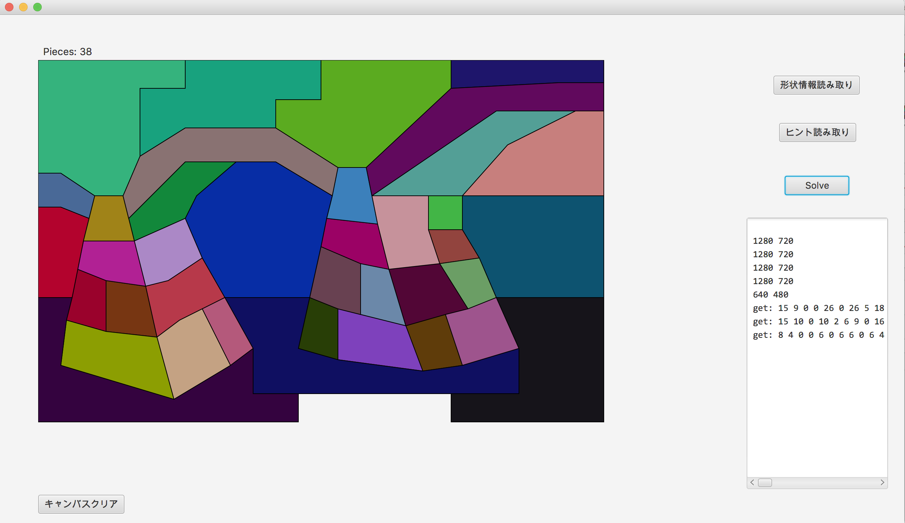

# kurosolver

第28回 全国高等専門学校プログラミングコンテスト競技部門において，沖縄高専(ピースチャンプルー)が使用したパズルソルバのコード

# 各試合の結果

||順位|結果|
|:-------|:-------|:-------|
|1回戦|1位|通過|
|準決勝|15位|敗退|

# スクリーンショット

# 開発環境

## OS
MacOS Sierra

## 言語
C++(LLVM clang 5.0.0)

## ライブラリ
Boost 1.65.1

## ビルドツール
waf 1.9.4

## 実行方法

`make` でビルドした後 `./build/solver` で実行

# License

MIT
